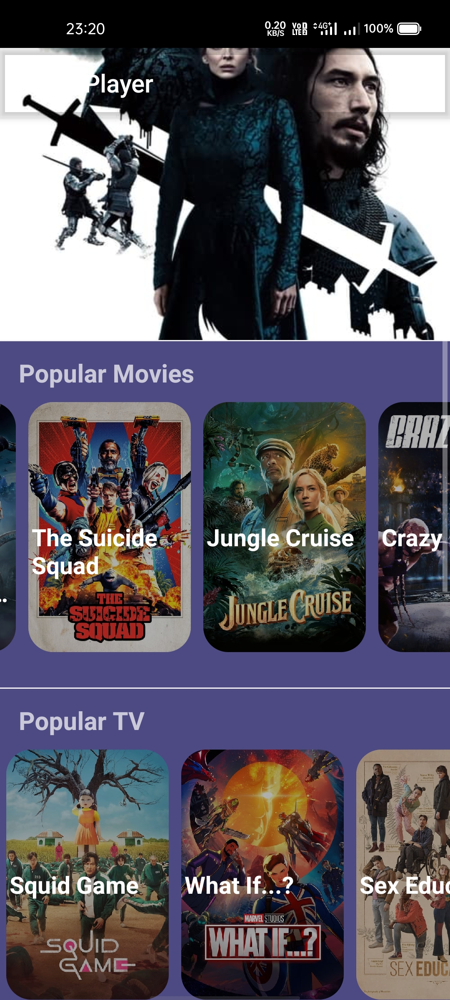

A simple react native app that displays movies data using [TMDB](https://www.themoviedb.org/) API. There's also implemented a video player(with a sample video) too which definitely doesn't stream the TMDB movies

    
 

 

    
 

 

    
 

